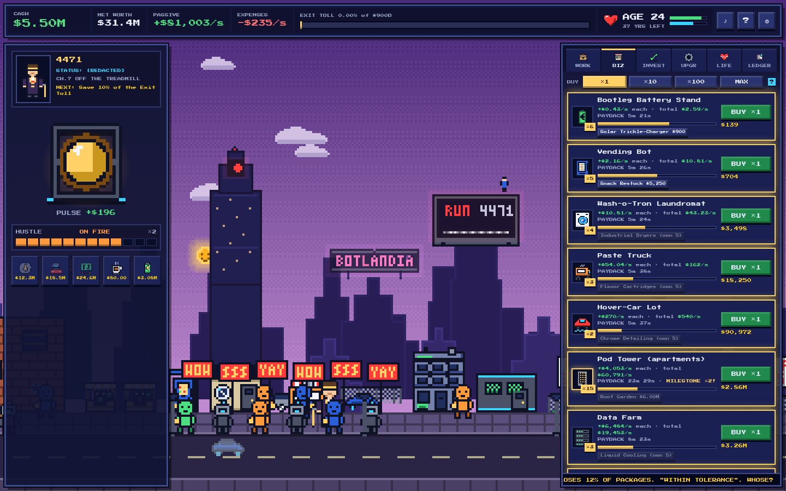

# Escape Botlandia 🤖💸
*Note: This is currently under development and will be released soon.*

**An 8-bit cash-flow tycoon game.** You wake up at 18, homeless and $2,000 in debt, in Botlandia, a city run by bots
where humans live on the Wage Treadmill. Work a job to get your first capital, buy businesses that pay you while you
sleep, invest, dodge the doodads, buy yourself more years, get **out of the rat race** and pay the **Exit Toll**
before your time runs out.

Or die a wage slave. That is a real ending.



It is a cookie clicker at heart, but instead of cookies you build cash flow. Along the way the game teaches the ideas
behind *Rich Dad Poor Dad*, the *Cashflow* board game and *Build Your Stax*: assets vs liabilities, cash flow vs
capital gains, compound interest and the Rule of 72, index funds and dividends, good debt vs bad debt, lifestyle
inflation, taxes on earned vs passive income, diversification, opportunity cost, and why time is the scarcest asset.

## Play it

Open `index.html` in any modern browser. There is nothing to install and no build step. The game saves itself in
your browser and keeps earning (at half speed) while the tab is closed.

Hosted edition, once the repo owner enables Pages (*Settings → Pages → Source: GitHub Actions*; the included
workflow deploys `main` on every push): **https://goatercoder.github.io/Escape-Botlandia/**

Controls: click the big Machine (or press **Space**) to hustle · **1–6** switch tabs · **M** mutes · **Esc** closes
a card. Hover anything for an explanation; the cyan **?** chips open a note from Glitch, your mentor.

## The story

| Chapter | What happens | The Machine you click |
|---|---|---|
| 1 · Wake Up, 4471 | Homeless, $2,000 in debt, 44 years to live. | a cardboard sign |
| 2 · Punch In | Bot-Corp hires you. Every shift is taxed 35%. | a punch clock |
| 3 · The Side Hustle | Your first business appears in the city. | a cash register |
| 4 · The Treadmill | The Freedom meter, Doodad Dan, rent, the Doc Module. | |
| 5 · Paper Assets | Index funds, dividends, bonds, BitBot, market crashes. | a vault door |
| 6 · Bricks | Real estate and good debt. The Mainframe starts counting your freedom. | |
| 7 · Off the Treadmill | Passive income beats expenses: the Fast Track opens. | a golden core |
| 8 · The Exit Gate | Save the toll. Walk out into the sunrise. | the exit lever |

Characters: **Glitch** (a rogue repair bot, your "rich dad"), **Supervisor 9-2-5** (kind and wrong),
**Repo-Tron 3000** (your debt, with a claw), **Doodad Dan v2.0** (never lies, never mentions the monthly cost),
**Doc Module** (sells years, no refunds), **R.E.S. TaxBot**, **Landlord Unit L-0RD** and **Maya**, who got out.

## How it works

| Thing | Rule |
|---|---|
| **Hustle meter** | Click fast to heat up: HUSTLIN' ×1.5 → ON FIRE ×2 → OVERTIME ×3. Hit 100 and you burn out (8 s lockout, −2 health). A steady rhythm wins. |
| **Jobs** | Seven rungs from Scrap Sorter to Compliance Executive. Pay is taxed 35% and every promotion forces pricier housing (golden handcuffs). You can decline, negotiate a 4-day week, or quit. |
| **Businesses** | 14, from a Bootleg Battery Stand ($60) to an Orbital Mine ($220B). Each next one costs 11–15% more; owning 10/25/50/100/200 multiplies output; three upgrades each. Each shows its payback time. |
| **The city** | Every business you buy appears and animates behind the UI: hover-cars leave the lot, the Pod Tower grows floors, drones cross the sky. |
| **Investments** | Index fund, dividend stock, bond, REIT and BitBot, on a seeded random walk. Dividends count as passive income; price gains only when you sell (taxed). Crashes open a 20-second BUY THE DIP window. Bonds never crash. |
| **Debt** | Repo-Tron's bad debt at 12%/yr; unpaid bills become debt automatically. Bot-Bank's good debt at 8%, capped at half your businesses' value, with a live "does leverage pay?" readout. |
| **Doodads** | Hover-Bikes to Moon Plots: status now, upkeep forever. When your passive income can cover it, a third option appears: let the assets buy the toy. |
| **Lifespan** | One year = 150 seconds. You start at 18 with 44 years left. The Doc Module sells years (Gym +2 … Cryo-Chamber +10, max age 100) and one scam. Health under 20 risks a sudden shutdown; the Medbay is cheap. |
| **Out of the rat race** | Once you own real estate: passive income ≥ 125% of expenses for 3 months with no bad debt. |
| **Escape** | While out of the rat race, pay the Exit Toll. Your rank depends on your age: GHOST IN THE MACHINE, OWNER, RUNNER or RAT. |
| **Wisdom** | Every ending grants Wisdom (half if you die a wage slave). Each point is +2% income forever; thresholds unlock perks. New Game+ raises the toll ×3 and shows ghosts of your last city. |
| **Events** | Choice events let you make the mistakes: buy the Lambo on credit, consolidate at 29%, go all-in on MoonCoin, sell in a crash, quit too early. Then a "what if" shows what would have happened. |
| **Golden Bot** | Every few minutes a glitch in the matrix walks across the street. Click it for a frenzy, a lump sum, lucky shifts or a point of Wisdom. |
| **Glitch's Ledger** | 22 one-paragraph lessons arrive as envelopes and never block play. Each reward demonstrates its lesson. |

The clock stops while you read a story scene or a card, so learning never costs you life.

## Balance

`tools/sim.js` plays the real engine with scripted strategies, and `npm test` enforces the result:

| Strategy | Outcome |
|---|---|
| Optimiser (clicks, promotions, best-payback buys) | escapes at 104–130 min, age 59–70: it needs a little life extension |
| Pure job grinder (never buys a business) | always dies a wage slave |
| Idle after 5 minutes | survives the first hour and escapes late |

A normal human run takes roughly 2–3 hours.

## Project layout

```
index.html        the page: top bar, YOU column, THE MARKET tabs, dialogue, modals, title screen
style.css         8-bit theme and responsive layout (bundled Press Start 2P font, OFL)
data.js           all content: jobs, housing, businesses, investments, health, power-ups, doodads,
                  chapters, cast, 22 lessons, 14 choice events, 58 achievements, endings, tutorial, tips, news
engine.js         pure, seeded game rules (no DOM): tick, click, buy, invest, chapters, lessons, events,
                  death, escape, prestige, offline progress, save/load
sprites.js        pixel art as character grids: avatar stages, Machine forms, portraits, bots, icons
sprites-city.js   buildings (5 growth levels each), vehicles, props and palettes for the city
scene.js          the animated city canvas behind the UI
audio.js          WebAudio chiptune SFX and music, no asset files
ui.js             DOM: panels, tabs, tooltips, dialogue, toasts, chapters, events, lessons, endings, tutorial
main.js           boot, game loop, autosave, offline progress, save export/import
tools/sim.js      headless balance simulation
test/             node --test: rules tests and the balance gate
docs/SPEC.md      the full design document and module contract
```

## Development

```
npm test            # 64 rules tests + the balance gate
npm run check       # node --check on every module
npm start           # serve on http://localhost:8080 (any static server works)
node tools/sim.js   # print pacing for the three strategies
```

In the browser console, `BOTLANDIA.state` is the live game state and `BOTLANDIA.tick(60)` fast-forwards a minute.

Add a business: one row in `Data.BUSINESSES` plus a building in `sprites-city.js`. Add a lesson: one row in
`Data.LESSONS` with a trigger condition from the DSL documented at the top of `data.js`. Re-run `npm test`
after touching any number.

## Disclaimers

The money ideas are simplified for a game, not financial advice. An 8% index return is a long-run illustration,
not a promise; tax rates are Botlandia's; the Rule of 72 is an approximation. Everything stays in your browser's
`localStorage`: no accounts, no servers, no tracking.
